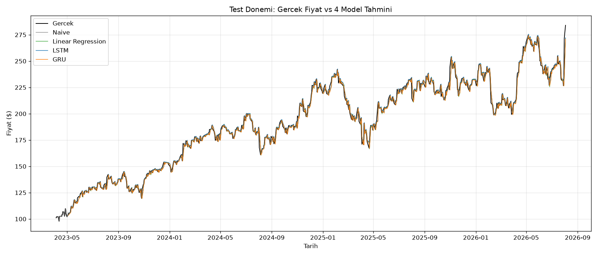

# stock_price_prediction_microsoft

Microsoft yaz staj projesi: AMZN hisse senedi günlük kapanış fiyatını LSTM ve GRU ile
tahmin etmeye çalışan, sonuçlarını Naive ve Linear Regression baseline'larıyla karşılaştıran
uçtan uca bir zaman serisi pipeline'ı.

## Amaç

Tek değişkenli (sadece `Close` fiyatı) bir zaman serisinden bir sonraki günün fiyatını tahmin
etmek ve iki tekrarlayan sinir ağı mimarisinin (LSTM, GRU) bu görevde basit baseline'lardan
(dünkü fiyatı kopyalama, doğrusal regresyon) daha iyi sonuç verip vermediğini ölçmek.

## Veri Seti

- **Kaynak:** [yfinance](https://pypi.org/project/yfinance/) (`data_loader.py`, ticker `AMZN`)
- **Çekim tarihi:** 2026-08-06
- **Tarih aralığı:** 2010-01-04 → 2026-08-03 (4170 iş günü)
- **Diskteki dosya:** `data/AMZN.csv` (tekrar indirmeyi önlemek için commit'lenmiştir)

## Klasör Yapısı

```
data/                  AMZN.csv (ham OHLCV verisi)
notebooks/
  stock_prediction.ipynb   pipeline'ı baştan sona çalıştıran notebook
results/               tüm ara/son çıktılar (model ağırlıkları, grafikler, metrikler)
src/
  data_loader.py        veri indirme/okuma
  explore.py             keşifsel analiz (NaN, istatistik, fiyat grafiği)
  preprocessing.py       kronolojik bölme, log-return, sızıntısız ölçekleme
  windowing.py            kayan pencere (X, y) örnekleri
  baselines.py            Naive ve Linear Regression baseline'ları
  models.py               StockLSTM, StockGRU (nn.Module)
  train.py                eğitim döngüsü (MSE + Adam)
  run_experiment.py       LSTM ve GRU'yu aynı veriyle eğitip results/'a kaydeder
  evaluate.py             4 modeli aynı test gün kümesinde karşılaştırır, grafik/tablo üretir
requirements.txt
```

## Kurulum

```bash
pip install -r requirements.txt
```

## Çalıştırma

Sırayla (her script bir öncekinin `results/` çıktısına bağımlı):

```bash
cd src
python data_loader.py       # data/AMZN.csv indirir (yoksa)
python run_experiment.py    # LSTM + GRU'yu 100 epoch eğitir, results/'a kaydeder
python evaluate.py          # 4 modeli karşılaştırır, results/comparison.md + grafikleri üretir
```

Ya da tüm pipeline'ı tek seferde, açıklamalarıyla görmek için:

```bash
jupyter notebook notebooks/stock_prediction.ipynb
```

## Metodoloji — Kısa Notlar

- **Kronolojik bölme:** İlk %80 train, son %20 test; shuffle yok (geleceği görmemek için).
- **Sızıntısız ölçekleme:** `MinMaxScaler` SADECE train verisine fit edilir.
- **Log-return hedefi:** Model, ham fiyat seviyesi yerine günlük log-return tahmin ediyor.
  Fiyat seviyesiyle ölçeklendiğinde, test döneminde fiyat train aralığının (~$186 max) dışına
  çıkınca (test'te $284'e kadar çıkıyor) model ekstrapolasyon yapmak zorunda kalıp sistematik
  olarak düşük tahmin üretiyordu; return dar ve durağan bir aralıkta kaldığı için bu sorunu
  ortadan kaldırıyor.
- **Adil karşılaştırma:** Naive, Linear Regression, LSTM ve GRU'nun hepsi aynı 814 günlük test
  gün kümesinde (`test[20:]`, pencereleme yüzünden) değerlendirilir; bu `evaluate.py` içinde
  assert ile doğrulanır.

## Sonuçlar

`results/comparison.md`:

| Model | RMSE ($) | MAE ($) | Eğitim süresi (s) |
|---|---|---|---|
| Naive | 4.0400 | 2.8155 | - |
| Linear Regression | 4.0862 | 2.8661 | - |
| LSTM | 4.0456 | 2.8229 | 21.81 |
| GRU | 4.0745 | 2.8485 | 54.52 |

**LSTM ve GRU, Naive baseline'ı geçemedi.** İkisi de Naive'e yakın ama ölçülebilir şekilde
daha kötü RMSE veriyor. İncelemede, modellerin öğrenilebilir bir sinyal bulamayıp neredeyse
sabit bir return değerine yakınsadığı (tahmin edilen return'ün standart sapması gerçek
return'ün standart sapmasının ~1/70'i, gerçek return ile korelasyon ~0) görüldü — yani mevcut
haliyle model, günlük fiyat hareketini gerçekten öğrenmiyor.



## Sonraki Adımlar

- Ek özellikler (hacim, teknik indikatörler, çoklu hisse) olmadan tek değişkenli kapanış
  fiyatından Naive'i geçmek zor olabilir (etkin piyasa hipotezi ile tutarlı bir sonuç).
- Mode collapse'ı azaltmak için farklı loss fonksiyonları, öğrenme oranı programı veya daha
  fazla/az kapasiteli mimariler denenebilir.
